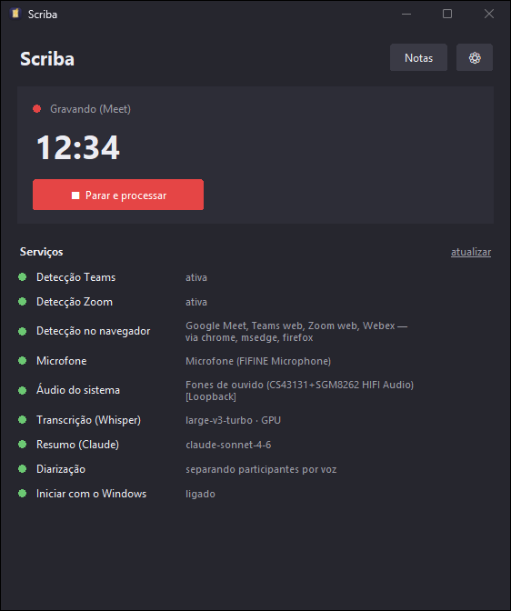
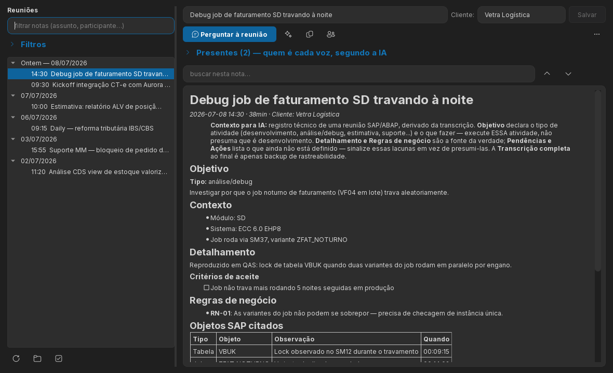
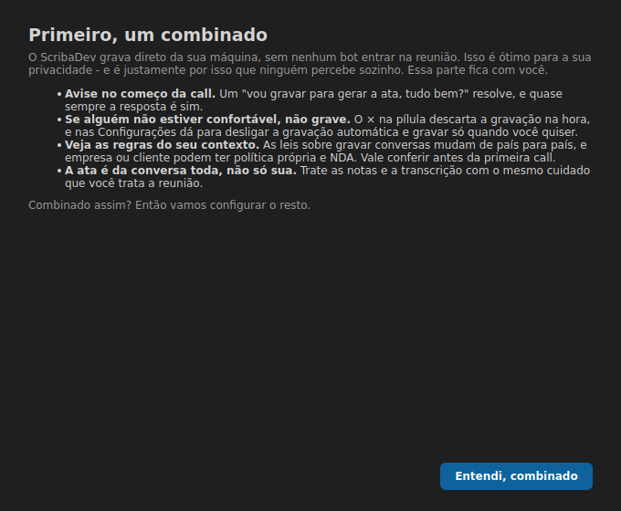
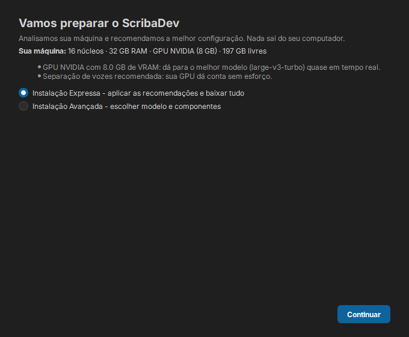
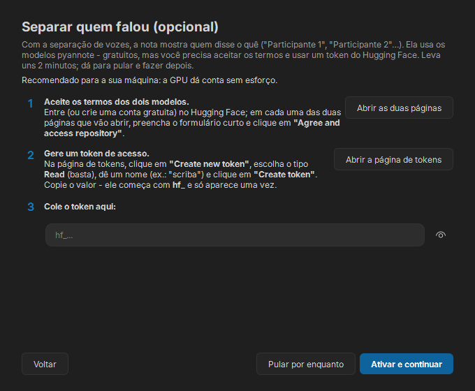
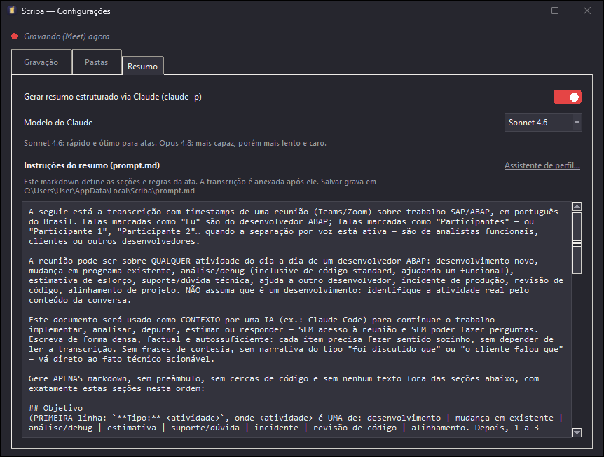
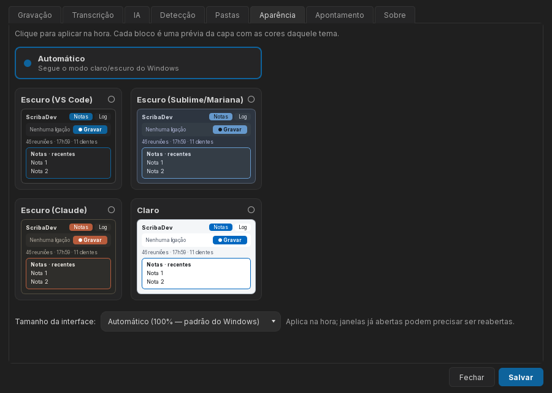
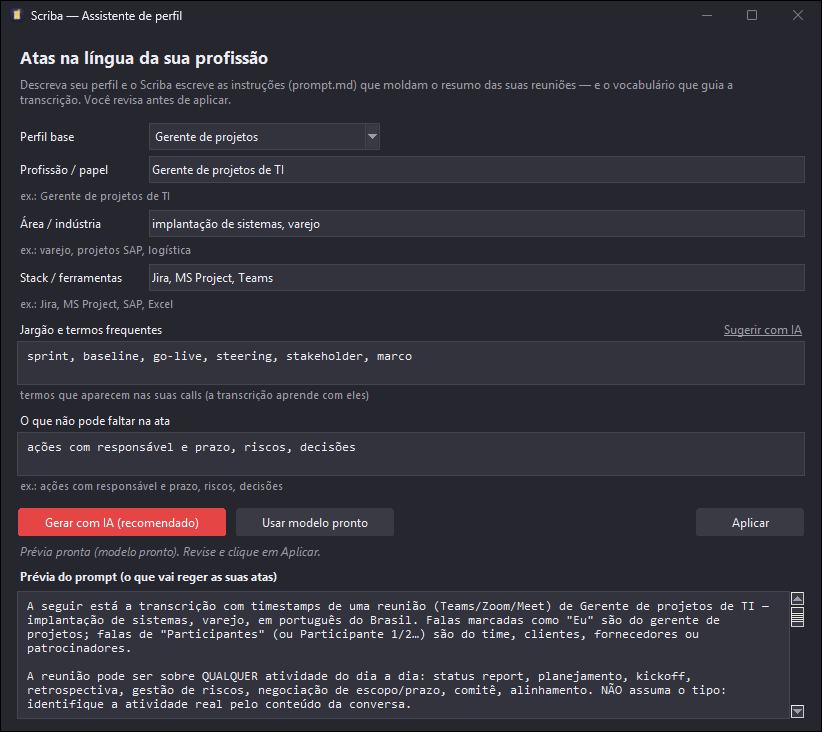
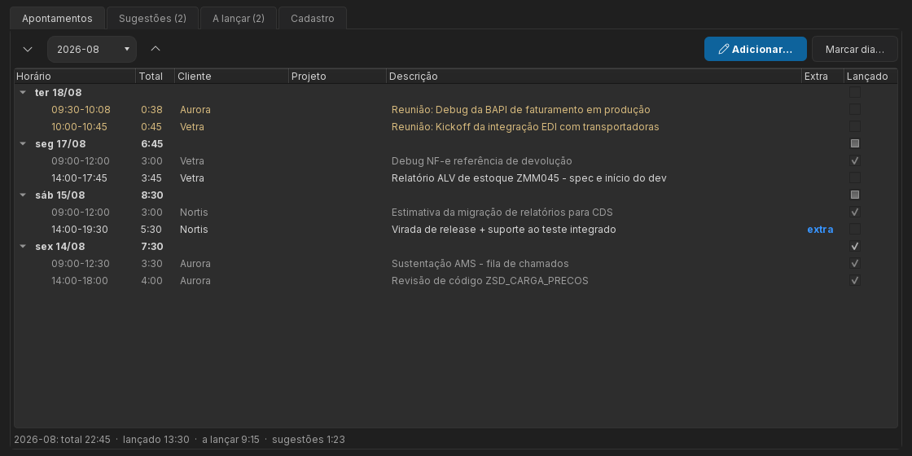

# ScribaDev

> 🎙️ Automatic recording, transcription and minutes for your meetings — Teams, Zoom, Google Meet and browser friends — 100% local and private.

[](LICENSE)


🇧🇷 [Português](README.md) | 🇺🇸 English

> ⚠️ **Important notice:** call-recording laws **vary by country**, and company/client policies may require **explicit consent**. Depending on your context, **let participants know the call is being recorded for transcription**. The app records locally and does not notify anyone for you — you are responsible for how you use it. See the [Legal notice](#legal-notice).

<p align="center">
  
  <br><br>
  
  <br><br>
  
</p>

ScribaDev lives in the Windows tray (or the macOS menu bar) and **detects by itself when you join a Teams or Zoom call — or a meeting in the browser** (Google Meet, Teams web, Zoom web…). It records the audio (no bot ever joins the meeting), transcribes locally with Whisper on your GPU/CPU and produces a Markdown file **with a title, client and structured summary** (participants, decisions, requirements, SAP objects mentioned, action items) plus the **full transcript**, with turns attributed to **Me** (your microphone) and **Participants** (the audio you hear) — or **Participante 1/2/3** with optional diarization. Think of it as a minimalist, local, homemade "Granola" — built for people who feed meeting notes into development tools such as Claude Code.

## How it works

```
Windows registry ──► call detected (mic in use by Teams/Zoom — or by the browser,
        │             confirmed via window title: Meet, Teams web, Zoom web…)
        │
        ▼
records 2 WAV tracks ──► microphone ("Eu") + output loopback ("Participantes")
        │  (floating pill on screen while recording: ● 12:34  ■ ×)
        ▼
call ends ──► local Whisper (faster-whisper large-v3-turbo, GPU or CPU)
        │       the model only loads when the call ends: the GPU stays free during the meeting
        ▼
local pyannote (optional) ──► splits voices into Participante 1/2/3
        │
        ▼
claude -p (optional) ──► meeting title + client + structured summary
        │
        ▼
notas.md ──► exported to %LOCALAPPDATA%\ScribaDev\Notas\
        │
        ▼
audio archived as Opus (~20 MB/h) ──► folder renamed with the note's title
```

- **Detection without APIs**: Windows tracks when Teams/Zoom opens the microphone (`HKCU\...\CapabilityAccessManager\ConsentStore\microphone`). ScribaDev just watches that key — any account, no Graph API, no admin rights. On **macOS**, the same state machine runs on CoreAudio *process objects* (who has the mic open) with window titles from the Accessibility API.
- **Browser meetings**: an open mic in Chrome/Edge/Firefox could be any website, so the call is only confirmed when some browser window bears a meeting title ("Meet", "Microsoft Teams", "Zoom", "Webex" — configurable). Once confirmed, the call stays alive for as long as the mic is open: switching tabs doesn't drop the recording.
- **"Me" vs "Participants" by construction**: your voice comes from the mic and everyone else's from the output loopback — two separate tracks. With optional diarization, remote speakers are further split into **Participante 1/2/3**.
- **Everything local**: audio never leaves your machine. Only the transcribed *text* is sent out (and only if the Claude summary is enabled).

## Requirements

| Item | Notes |
|---|---|
| Windows 11 **or** macOS 14.2+ (Apple Silicon) | Windows uses WASAPI loopback and toasts; macOS uses CoreAudio process taps and Metal (MLX) transcription |
| Python 3.12–3.14 *(source install only)* | the **installer** needs no Python — `winget install Python.Python.3.12` if contributing |
| Teams/Zoom (desktop) or browser meetings | auto-detection for both; Meet, Teams web and friends are confirmed via the window title |
| NVIDIA GPU *(optional)* | ~10× faster transcription; falls back to CPU automatically |
| [Claude Code](https://claude.com/claude-code) *(optional)* | only for the structured summary; without it you get the plain transcript |
| [ffmpeg](https://ffmpeg.org/download.html) *(recommended)* | compresses the kept audio: raw WAV ~1.3 GB/h → **Opus ~20 MB/h**. Install with `winget install ffmpeg` — it adds itself to the **Windows PATH** (not a ScribaDev folder) — and **reopen the app**; check with `where ffmpeg`. Without it, recordings stay as raw, huge `.wav` |
| Headphones *(recommended)* | with speakers, other people's voices leak into your mic and get duplicated as "Me" |

## Install

### Option A — Installer (recommended)

Download from the [Releases page](https://github.com/allanrmartins/ScribaDev/releases) and install — **no Python, no terminal**:

- **Windows**: `ScribaDev-X.Y.Z-setup.exe`. The installer is not code-signed (open source project without a paid certificate), so SmartScreen warns on first run: click **"More info" → "Run anyway"**. Per-user install (no admin prompt).
- **macOS** (14.2+, Apple Silicon): `ScribaDev-X.Y.Z.dmg`. Drag the app to **Applications** and, **before the first launch**, clear the quarantine flag your browser puts on the download (same reason as Windows: the app is neither signed nor notarized):

  ```bash
  xattr -dr com.apple.quarantine /Applications/ScribaDev.app
  ```

  Only then open the app, and grant the **Microphone**, **Screen & System Audio Recording** and **Accessibility** permissions when prompted.

  > ⚠️ **Do not use right-click → Open any more.** macOS 15+ removed that shortcut and, depending on the XProtect version, launching the app while it is still quarantined leaves it **stuck at startup**: no window appears and, a while later, the system reports the app is not responding. If that already happened, clearing the quarantine flag *afterwards* does not help — macOS caches the block: **delete `/Applications/ScribaDev.app`, copy it from the DMG again, run the command above, and only then open it.**

On first launch, the **first-run wizard** analyzes your machine (GPU, memory, disk) and recommends the best setup:

- The first page is **the ground rules**: tell the other participants before you record, and check the rules that apply to you (same as [Legal notice](#legal-notice));
- **Express install** accepts the recommendations and downloads everything at once (Whisper model, CUDA libraries if you have an NVIDIA GPU);
- **Advanced install** lets you pick the transcription model (tiny → large-v3-turbo, with size and speed for each) and the components;
- **Speaker separation** (pyannote) has a guided walkthrough to accept the terms and create the Hugging Face token — and can be **skipped** and enabled later in Settings.

<p align="center">
  
  <br><br>
  
  <br><br>
  
</p>

### Option B — from source (to contribute)

`setup.ps1` does everything: creates an isolated Python environment at `%LOCALAPPDATA%\ScribaDev\venv`, installs dependencies (with CUDA support if an NVIDIA GPU is present, ~1.3 GB), downloads the Whisper model (~1.6 GB on first run), puts the `scribadev` command on your PATH and finishes by running `scribadev doctor`.

```powershell
git clone https://github.com/allanrmartins/ScribaDev.git
cd ScribaDev
powershell -ExecutionPolicy Bypass -File .\setup.ps1
```

On macOS, the equivalent is `./setup.sh`. See [CONTRIBUTING.md](CONTRIBUTING.md).

**Without git (ZIP):** on GitHub, click **Code → Download ZIP**, extract it, open a PowerShell in the extracted folder and run `powershell -ExecutionPolicy Bypass -File .\setup.ps1`.

> 💡 **Diarization** (splitting turns into *Participante 1/2/3*) is **optional**. With the installer, the wizard handles it; on source installs, follow [Speaker separation](#speaker-separation-optional) if it shows as `dependências ausentes` in the **Services** panel.

### Where files live

| What | Where (default) | Configurable? |
|---|---|---|
| Final notes (`.md`) | `%LOCALAPPDATA%\ScribaDev\Notas\` | ✅ Settings window |
| Recordings (one folder per meeting, in a date tree named after the note's title: `2026\06\12\16-34_Boleto não gerado em produção\`) | `C:\temp\scribadev\gravacoes\` | ✅ Settings window |
| Summary prompt (`prompt.md`) | `%LOCALAPPDATA%\ScribaDev\prompt.md` | ✅ Summary tab (built-in editor) |
| Config, logs and Python environment | `%LOCALAPPDATA%\ScribaDev\` | — |

All output folders are **created automatically on first use** — nothing to create by hand on a fresh machine.

## Update

The installed version shows in the **title bar** and on the window **cover** (and in `scribadev --version`).

**Installer (Option A)**: when a new version is out, the cover shows a notice with a **Download** button pointing at your OS's installer. Install over the old one — **config, notes and recordings are preserved**.

**Source with git (Option B)** — update with one command:

```powershell
scribadev update --check    # only check whether a new version exists
scribadev update            # apply: git pull + reinstall if dependencies changed
```

After updating, **close and reopen** ScribaDev (tray → **Quit**, then reopen from the shortcut) to load the new version.

**Without git (Option B — ZIP)**: download the new ZIP from GitHub (**Code → Download ZIP**), extract it over the folder and run `setup.ps1` again — it reuses the venv and only updates what changed.

## Usage

```powershell
scribadev run            # start monitoring (tray icon)
scribadev autostart on   # optional: start with Windows
```

Join a Teams call (or a Meet in the browser) and the pill shows up at the top of the screen, **staying for the whole call**:

- **● 12:34** — recording, with a timer (drag it anywhere; position is remembered)
- **■** — stop now and process
- **×** — discard this recording (calls that shouldn't become notes)
- **⏺ Record** — idle mode: shown when auto-record is off, or after you stop/discard mid-call; one click starts a (new) recording

The pill only disappears when the call ends. With `auto_record` off (Settings), nothing is recorded until you click ⏺. When you leave the call: a "Transcribing…" toast, then "Notes ready" with a button that opens the `.md`.

**Double-click the tray icon** to open the **main window** - the antechamber to your notes: **recent meetings** (click to open the note; **right-click** to open the recording folder or **delete the meeting**), a summary in numbers (**how many meetings, total time recorded, clients**), the **open action items** across all notes with a counter, the **live call in progress with a running duration** and the **⏺ Record** button, and a prominent **Notas** button. Service diagnostics (detection, audio, Whisper/GPU, Claude, diarization, autostart) live in a collapsible **Serviços** section. Minimizing keeps the app in the taskbar; closing (X) removes it from the taskbar while monitoring continues in the tray.

The **Notas** button opens the **Notes window** - the heart of the app: on the left, meetings **grouped by day** with **content search** (highlights matches) and **collapsible filters** (date, client, participant); on the right, the markdown reader, with **AI-identified, editable title and client** (when the client can't be inferred from the conversation, the field is left blank for you to type) and a **live progress bar** for meetings still transcribing/summarizing. An **action bar** offers generating the context prompt, copying, **"ask the meeting"** (a chat that searches the transcript), labeling speakers and **deleting** (the trash button, the **Delete** key on the list or the right-click — with an option to also delete the audio; without it, the recording stays as backup). Tables (e.g. **SAP objects**) render as **real tables** with **⧉ copy (Excel)** next to them - TSV that pastes straight into cells; the **full transcript** sits behind a link at the end of the document (show/hide without "jumping" your reading). Also: **keyboard shortcuts** and a **context menu** on the meeting list.

The **⚙** button opens **Settings**, with **Gravação / Transcrição / IA / Detecção / Pastas / Aparência / Sobre** tabs - grouped by category, including a **global record/stop hotkey** (capture the combo with the "Gravar atalho" button). In the **IA** tab, a `prompt.md` editor: the markdown instructions that drive the minutes (sections, rules, vocabulary) - customize freely, restore the default anytime. In the **Aparência** tab, pick a **theme**: *Automático* (follows the system's light/dark mode) or one of four - **VS Code**, **Sublime**, **Claude** and **Claro** - switched instantly; and adjust the **UI size** (100%–200%, hot-switched — on macOS the default already compensates the density difference). The **Sobre** tab shows component health (GPU, diarization, ffmpeg) and updates — and, on installer-based installs, a **Download components** section to grab later whatever was skipped on first use (Whisper model, NVIDIA libraries, voice separation). And if anything goes wrong anywhere, the **Log** window has a **Report** button: it saves the diagnostics (.zip) and opens a GitHub issue pre-filled with the latest errors.

<p align="center">
  
  <br><br>
  
</p>

On first run, the **profile assistant** opens by itself: describe your role, area, stack and jargon, and ScribaDev **writes the meeting-notes instructions tailored to your work** — AI-generated (and validated against the structure the notes reader expects) or from an offline-ready template — and also fills the **hotwords** that guide transcription with your vocabulary. Everything is previewed before applying (the previous prompt is kept as `prompt.md.bak`); reopen it anytime via the **Assistente de perfil…** link in the **IA** tab or with `scribadev wizard`.

<p align="center">
  
</p>

### Commands

| Command | Purpose |
|---|---|
| `scribadev run` | tray app: detection + recording + processing |
| `scribadev update` | check and apply updates (git pull); `--check` only checks |
| `scribadev --version` | show the installed version |
| `scribadev doctor` | environment diagnostic (`--toast` tests notifications) |
| `scribadev devices` | list available microphones and loopbacks |
| `scribadev record 60` | manual N-second recording (e.g. meetings outside Teams) |
| `scribadev transcribe <folder>` | (re)transcribe a meeting (`--cpu` forces CPU) |
| `scribadev summarize <folder>` | (re)generate the summary and notas.md |
| `scribadev process <folder>` | everything at once: transcribe + summarize + export |
| `scribadev detect` | debug: print detection state transitions live |
| `scribadev wizard` | profile assistant: generates prompt.md and hotwords for your role |
| `scribadev autostart on\|off` | shortcut in the Windows Startup folder |
| `scribadev shortcut` | (re)create the Desktop and Start Menu shortcuts |
| `scribadev purge` | delete already-transcribed recordings past the retention window (`--days N` overrides, `--dry-run` lists only) |
| `scribadev search "terms"` | search indexed meetings (full-text, `--client`, `--participant`, dates); `--json` for AI agents |
| `scribadev show <id-or-folder>` | print a meeting's note (`--transcript` for the transcript; `--json` for agents) |
| `scribadev reindex` | rebuild the search index from the recording folders |
| `scribadev timesheet list\|add\|export\|import` | timesheet module (optional — see [Timesheet](#timesheet-optional)) |

Tray menu: **Record now/Stop** (covers in-person meetings and apps outside detection), **Theme** (quick switch between themes), **Open meetings/notes folder**, **Process pending** (resumes work interrupted by a shutdown) and **Quit**.

### Timesheet (optional)

For anyone who must log hours in a company system: the **Timesheet** module turns every processed meeting into a **suggested entry** (client, rounded times, description) — you review, tweak and confirm. It ships **disabled**; enable it in **Settings → Apontamento** (until then nothing runs and no database is created). With the module on, a **Horas** shortcut appears on the main window.

<p align="center">
  
</p>

- **Post-call suggestions**: the meeting ends and the suggestion lands in a review queue — accept, **edit & accept** or **merge** (several fragmented calls become a single entry);
- **Manual entries pre-filled** from your own history (client → project → description), with **overtime** in its own column and split times (morning/afternoon in one dialog);
- **Clients with accent-insensitive aliases** ("Aurora", "aurora" and "Áurora" resolve to the same client) plus full registry management (rename, merge, deactivate);
- **"Posted" checkbox** per row or per whole day (posted rows dim — pending ones stand out);
- **Excel export** in the classic timesheet layout and **history import** (`scribadev timesheet import sheet.xlsx`, with `--dry-run`);
- All local, in the same spirit as the rest of the app.

### Ask about your meetings in Claude Code

The repo ships the **`scriba-reunioes`** skill (`.claude/skills/`): open [Claude Code](https://claude.com/claude-code) in the project folder and ask in natural language — *"what was my last meeting with client X?"*, *"what's still pending from yesterday's call?"* — and the AI queries the local index via `scribadev search --json` / `show`. Everything stays on your machine. To use the skill from **any folder**, create a junction/symlink to it in `~/.claude/skills/`.

## Output (`notas.md`)

```markdown
---
titulo: Relatório ALV de materiais ZMM001     ← AI-generated, editable in the app
cliente: Aurora                               ← identified from the conversation; blank = type it in the app
data: 2026-06-10T14:30:12
duracao_minutos: 47
origem: scriba
whisper: large-v3-turbo (cuda)
---

# Relatório ALV de materiais ZMM001

*2026-06-10 14:30 · 47 min · Cliente: Aurora*

> **Context for AI:** technical record of the meeting — perform the activity stated in Objetivo.

## Objetivo                      ← **Tipo:** development | analysis/debug | estimate | support… + what to do
## Contexto                      ← SAP module, system/release, environment
## Detalhamento                  ← shaped by the activity: functional spec, debug roadmap, estimation inputs…
### Critérios de aceite          ← verifiable `- [ ]` checklist
## Regras de negócio             ← RN-01, RN-02… business rules and algorithms spoken in the call
## Objetos SAP citados           ← table: Type | Object | Note | When
## Decisões                      ← self-contained, with [HH:MM:SS] timestamps
## Pendências e Ações            ← what's NOT defined yet (gaps for the AI to flag)
## Participantes                 ← with diarization: "Participante 1 — João, functional"

---

## Transcrição completa

**[00:00:12] Participante 1:** Bom dia! Precisamos de um relatório na ZMM001...
**[00:00:45] Eu:** Entendi. O campo MATNR vem da MARA?
```

`notas.md` is formatted to be **used as context in an AI** (Claude Code, etc.): **Objetivo** classifies the activity — a call can be development, standard-code debugging, effort estimation, or helping a functional analyst or another ABAPer — and **Detalhamento** adapts to it; **Regras de negócio** captures business rules and algorithms spoken in the conversation, and **Pendências** points out what's still undefined so the AI flags it instead of assuming. The final copy goes to `%LOCALAPPDATA%\ScribaDev\Notas\` — and each meeting lives in its own folder under `C:\temp\scribadev\gravacoes\` (a `YYYY\MM\DD\` tree, renamed with the note's title), where the recording ends up **archived as 16 kHz mono Opus** (~20 MB/hour instead of ~1.3 GB of raw WAV — exactly the format Whisper consumes, lossless for transcription purposes). If a recording comes out incomplete (app killed mid-call, a mic stream that died), the note **warns at the top** from which minute the audio was lost. All configurable in the Settings window, including **retention**: already-transcribed recordings are deleted after N days (default 30; the final note is never touched).

## Configuration

Created on first run at `%LOCALAPPDATA%\ScribaDev\config.toml`:

```toml
[detection]
apps = "teams, zoom"     # monitored desktop apps in the Windows mic-usage registry
# Browser meetings: mic open in one of these processes + a window title matching
# browser_titles = call detected. browsers="" disables the web layer;
# browser_titles="" records any website using the mic.
browsers = "chrome, msedge, firefox, brave, opera, vivaldi"
browser_titles = "Meet, Microsoft Teams, Zoom, Webex"
min_call_seconds = 30    # shorter recordings are ignored (pre-join screen, mic test)
grace_seconds = 8        # mic released for up to X s still counts as the same call
auto_record = true       # record on call detection; when off, the pill waits for ⏺

[audio]
loopback_device = ""     # empty = default output; otherwise part of the name (scribadev devices)
keep_audio = true        # keep the meeting audio after transcribing
archive_format = "opus"  # opus (~20 MB/h) | flac (lossless ~110 MB/h) | wav (raw ~1.3 GB/h)
retention_days = 30      # delete already-transcribed recordings after N days (0 = never)

[whisper]
model = "large-v3-turbo" # any faster-whisper model
device = "auto"          # auto | cuda | cpu
language = "pt"
batch_size = 8           # batched inference (~2x faster); 0 disables
hotwords = "SAP ABAP BAPI BAdI CDS SE16N MARA ..."  # vocabulary that guides transcription

[diarization]
enabled = false          # Participante 1/2/3 by voice (see section below)
hf_token = ""            # Hugging Face read token

[summary]
enabled = true           # summary via Claude Code CLI (claude -p)
model = "claude-sonnet-4-6"  # or claude-opus-4-8 (dropdown in the Summary tab)

[ui]
overlay = true           # floating pill
hotkey = "ctrl+alt+r"    # global record/stop hotkey; empty disables

[output]
export_dir = ""          # empty = %LOCALAPPDATA%\ScribaDev\Notas
recordings_dir = ""      # empty = C:\temp\scribadev\gravacoes (created automatically)
```

ScribaDev defaults to Brazilian Portuguese, but `language`, `hotwords` and the summary prompt work with anything Whisper supports.

### Speaker separation (optional)

With **diarization** on, the other participants come out as **Participante 1/2/3** instead of a single "Participantes" — and the summary tries to map each one to names/roles mentioned in the conversation. Runs 100% locally (pyannote.audio on GPU/CPU):

1. **Install torch and pyannote in ScribaDev's venv** — paste into PowerShell:

   ```powershell
   $py = "$env:LOCALAPPDATA\ScribaDev\venv\Scripts\python.exe"
   & $py -m pip install torch --index-url https://download.pytorch.org/whl/cu128   # no NVIDIA GPU: & $py -m pip install torch
   & $py -m pip install "pyannote.audio>=4,<5"
   ```

2. **Accept the terms of the three models** (free, but gated): sign in — or create a free account — on Hugging Face and, on each of these pages, fill the short form and click **"Agree and access repository"**: [speaker-diarization-community-1](https://huggingface.co/pyannote/speaker-diarization-community-1) (what pyannote 4.x actually uses), [speaker-diarization-3.1](https://huggingface.co/pyannote/speaker-diarization-3.1) and [segmentation-3.0](https://huggingface.co/pyannote/segmentation-3.0);
3. **Generate an access token** at [hf.co/settings/tokens](https://huggingface.co/settings/tokens): click **"Create new token"**, pick the **Read** type (enough), name it (e.g. `scriba`) and click **"Create token"**. Copy the value — it starts with `hf_` and is **shown only once**;
4. In the **Gravação** tab: enable "Separar participantes por voz" and paste the token. The model downloads once; everything else is offline.

> 💡 When installed via the **installer** (setup.exe/DMG), the **first-run wizard** walks you through these steps — including the torch/pyannote download — no PowerShell needed.

## ScribaDev on macOS

Supported since **v1.4.0** (macOS 14.2+, Apple Silicon), contributed by [@dineiar](https://github.com/dineiar):

- **Capture** via CoreAudio *process taps* (the native equivalent of WASAPI loopback) + microphone;
- **Metal-accelerated transcription** (mlx-whisper) — no NVIDIA GPU, no CUDA;
- **Menu bar** with a template icon (follows light/dark), native notifications and autostart via LaunchAgent;
- Native **global hotkey** (Carbon) and the floating pill **excluded from screen sharing** — people on the call never see it;
- Call detection through the same state machine as Windows, over CoreAudio *process objects*.

**Permissions** (prompted on first use; managed under System Settings → Privacy & Security):

| Permission | Why |
|---|---|
| Microphone | your voice ("Me") |
| Screen & System Audio Recording | the other participants' audio (process tap) |
| Accessibility | window titles — browser call detection and meeting name |

> ⚠️ Without the **Screen & System Audio Recording** permission, the participants' track comes out **silent** (macOS won't warn you). If notes only contain "Me", check that permission first.

## Privacy

- **Audio never leaves your machine** — recording and transcription are 100% local.
- With `[summary] enabled = true`, the transcript **text** is sent to Anthropic through Claude Code (the account/subscription you already use). Disable it for a fully offline flow.
- Recordings and transcripts live in `C:\temp\scribadev\gravacoes` (configurable), away from synced folders — and are **deleted automatically** after the retention window (default 30 days; `0` keeps forever); config and logs in `%LOCALAPPDATA%\ScribaDev`. Only the final `.md` goes to `%LOCALAPPDATA%\ScribaDev\Notas`.

## Legal notice

ScribaDev records **locally** the audio entering and leaving your machine, without notifying the other participants (no bot joins the call). Call-recording laws vary by country, and company/client policies may require explicit consent. **Check the rules that apply to you before using it — you are responsible for how you use this tool.** The first-run wizard opens with these ground rules, so they don't live only in this README.

## Known limitations

- **Browser** detection confirms the call via a window title — if you join a meeting and switch tabs in the same instant, recording starts once the call tab becomes active again (the wait holds as long as the mic stays open). The pill, hotkey and **Record now** still cover every case.
- If Teams plays audio on a non-default output device, set `loopback_device`.
- Swapping headsets **mid-call** can silence the participants' track (stream reopen is on the roadmap).
- Without headphones, other people's voices also enter your mic and get duplicated as "Me".
- **macOS** support is recent (v1.4.0) and still maturing — issues and feedback are very welcome.

## Roadmap

- Stream reopen on mid-call device switch

## Development

Contributions are welcome - see [CONTRIBUTING.md](CONTRIBUTING.md). The codebase stays small and modular — one responsibility per file: `detector`, `recorder`, `transcriber`, `diarize`, `merge`, `notes`, `overlay`, `main_window`, `notes_ui`, `settings_ui`, `tray`, `main`. Before hacking: `scribadev doctor` (environment check) and `python -m unittest discover -s tests` (stdlib unittest suite, no pytest).

## License

ScribaDev is open source under the [MIT](LICENSE) license © Allan Martins.
Third-party licenses are listed in [THIRD-PARTY-LICENSES.md](THIRD-PARTY-LICENSES.md).
